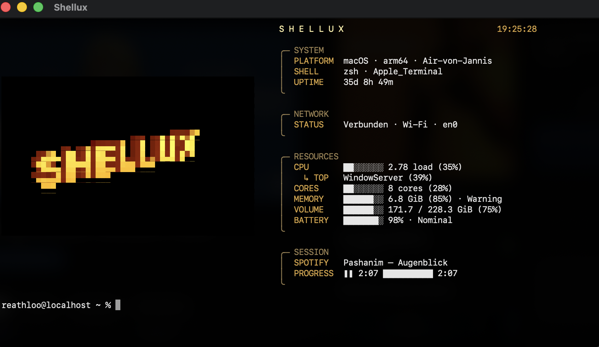
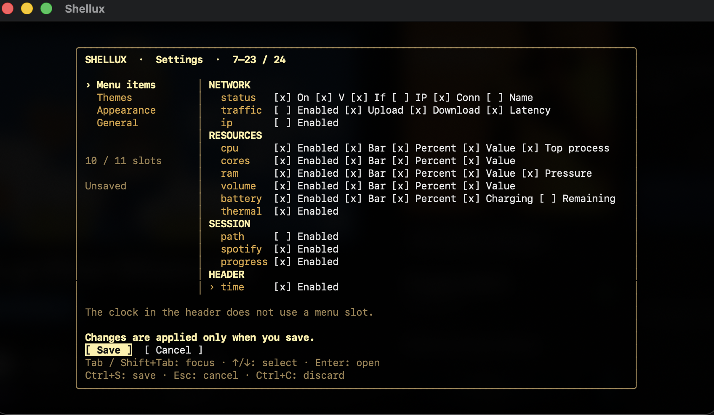

# Shellux

An animated system dashboard for **Zsh and Bash on macOS and Linux**.
System stats, music, and your own look right in the terminal, with your familiar prompt intact.



## Features

- **System overview:** CPU, RAM, storage, battery, network, and more.
- **Flexible display:** Toggle individual items and details such as bars, percentages, and time zones.
- **Your own look:** Animated themes with matching styles and backgrounds. Mix and match or save your own theme.
- **Spotify:** Current track and playback progress on macOS.
- **Visual settings:** Customize everything with your keyboard inside the terminal.

## Installation

Install the latest release with one command:

```sh
curl -fsSL https://raw.githubusercontent.com/reathloo/shellux/main/scripts/install-release.sh | sh
```

The installer detects macOS/Linux and your processor architecture, verifies the
downloaded archive with SHA-256, installs Shellux under `~/.local`, and adds it
to Zsh or Bash. Open a new terminal tab afterward.

For a manual installation, download the archive and `checksums.txt` from
[GitHub Releases](https://github.com/reathloo/shellux/releases), verify the
archive, extract it, and run:

```sh
./install.sh
```

This manual path prints the lines to add to your shell configuration without
changing it automatically.

## Customize

```sh
shellux settings
```

Explore **Menu items**, **Themes**, **Appearance**, and **General** to choose what
appears, select themes, set custom colors, and change the refresh interval.
Under **General → Language**, choose **Automatic (system)**, **English**, or
**Deutsch** for the dashboard and settings. Automatic uses the system/terminal
locale, with English as the fallback for other languages. Commands stay unchanged.



Use the **arrow keys** to navigate, **Tab** to switch sections, and **Space / Enter** to toggle or select.
**Ctrl+S** saves; **Esc** cancels. More keyboard shortcuts appear in the menu.

Changes take effect only when you **Save**, which restarts the header and clears scrollback.
**Cancel** discards your changes. Additional themes download only when you save
and remain available offline afterward. The default theme, general styles, and basic colors are built in.

## Everyday use

| Command | Action |
| --- | --- |
| `shx` | Bring back the header and clear scrollback |
| `shellux off` / `shellux on` | Disable or enable the header in the current tab |
| `shellux doctor` | Check your installation |
| `shellux help` | Show all commands |

The header pauses while commands run so their output stays readable and scrollable.
Bring it back with `shx` or `shellux reload`.
Customization commands remain available as an alternative to the settings menu.

## Good to know

- Up to **11 menu slots**; empty categories disappear automatically.
- Some metrics depend on your system and permissions. Unavailable values appear as `N/A`.
- Spotify requires the desktop app and may need macOS Automation permission.
- Thermal shows thermal state, not a temperature in °C. Optional setup with `shellux thermal enable` requires administrator privileges.
- Background colors require a terminal that supports changing them.

## Development

Requires **Go 1.27.1 or later**. On macOS, the Xcode Command Line Tools are also required.
From the cloned repository:

```sh
go mod verify
go run ./tools/theme-pack -check
go test ./...
go test -race ./...
go vet ./...
sh shell/shellux_test.sh
sh scripts/install_test.sh
sh -n scripts/install.sh scripts/install-release.sh
```

[CI](.github/workflows/ci.yml) also tests shell integration and the interactive settings menu on macOS and Linux.

To publish your own theme packages, see the [guide](themes/README.md).

## License

Shellux is licensed under the [PolyForm Noncommercial License 1.0.0](LICENSE).
You may use, modify, and redistribute the code for noncommercial purposes.
Commercial use or sale requires separate permission from the copyright holder.
Shellux is **source-available**, rather than open source in the formal sense.
Rights to third-party graphics and other content remain with their respective owners.
